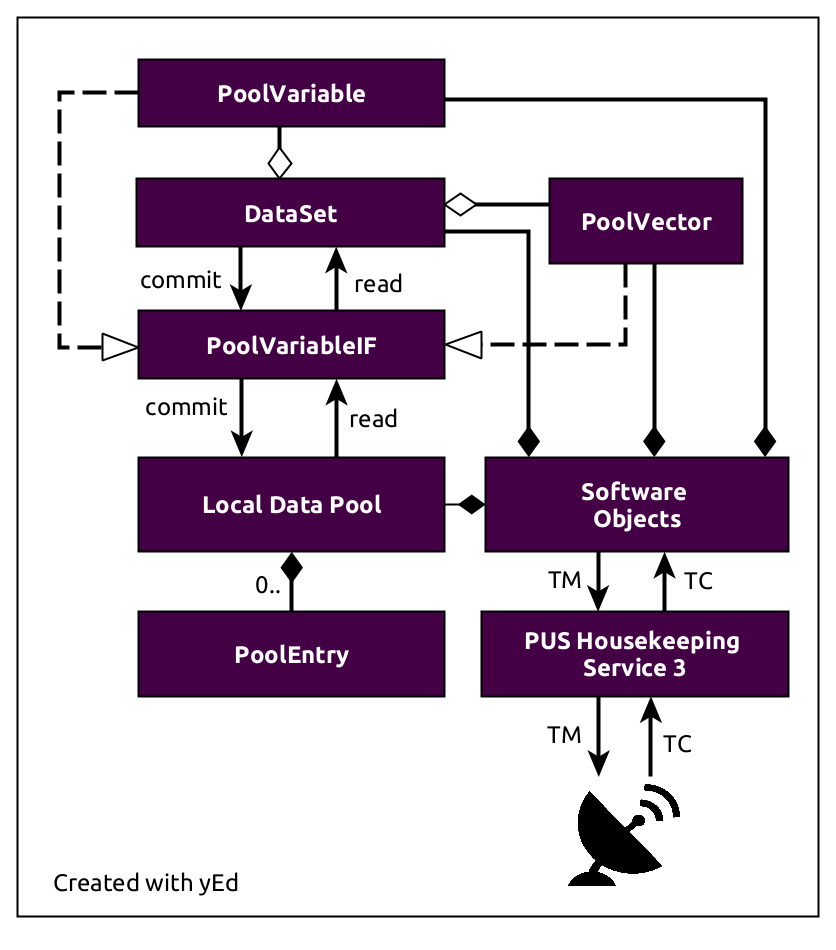

Local Data Pools
=========================================

The following text is targeted towards mission software developers which would like
to use the local data pools provided by the FSFW to store data like sensor values so they can be
used by other software objects like controllers as well. If a custom class should have a local
pool which  can be used by other software objects as well, following steps have to be performed:

1. Create a ``LocalDataPoolManager`` member object in the custom class
2. Implement the ``HasLocalDataPoolIF`` with specifies the interface between the local pool
   manager and the class owning the local pool.

The local data pool manager is also able to process housekeeping service requests in form
of messages, generate periodic housekeeping packet, generate notification and snapshots of changed
variables and datasets and process notifications and snapshots coming from other objects.
The two former tasks are related to the external interface using telemetry and telecommands (TMTC)
while the later two are related to data consumers like controllers only acting on data change
detected by the data creator instead of checking the data manually each cycle. Two important
framework classes ``DeviceHandlerBase`` and ``ExtendedControllerBase`` already perform the two steps
shown above so the steps required are altered slightly.

Storing and Accessing pool data
-------------------------------------

The pool manager is responsible for thread-safe access of the pool data, but the actual
access to the pool data from the point of view of a mission software developer happens via proxy
classes like pool variable classes. These classes store a copy
of the pool variable with the matching datatype and copy the actual data from the local pool
on a ``read`` call. Changed variables can then be written to the local pool with a ``commit`` call.
The ``read`` and ``commit`` calls are thread-safe and can be called concurrently from data creators
and data consumers. Generally, a user will create a dataset class which in turn groups all
cohesive pool variables. These sets simply iterator over the list of variables and call the
``read`` and ``commit`` functions of each variable. The following diagram shows the
high-level architecture of the local data pools.

An example is shown for using the local data pools with a Gyroscope.
For example, the following code shows an implementation to access data from a Gyroscope taken
from the SOURCE CubeSat project:

.. code-block:: cpp

	class GyroPrimaryDataset: public StaticLocalDataSet<3 * sizeof(float)> {
	public:
	    /**
	     * Constructor for data users
	     * @param gyroId
	     */
	    GyroPrimaryDataset(object_id_t gyroId):
	            StaticLocalDataSet(sid_t(gyroId, gyrodefs::GYRO_DATA_SET_ID)) {
	        setAllVariablesReadOnly();
	    }

	    lp_var_t<float> angVelocityX = lp_var_t<float>(sid.objectId,
	            gyrodefs::ANGULAR_VELOCITY_X, this);
	    lp_var_t<float> angVelocityY = lp_var_t<float>(sid.objectId,
	            gyrodefs::ANGULAR_VELOCITY_Y, this);
	    lp_var_t<float> angVelocityZ = lp_var_t<float>(sid.objectId,
	            gyrodefs::ANGULAR_VELOCITY_Z, this);
	private:

	    friend class GyroHandler;
	    /**
	     * Constructor for data creator
	     * @param hkOwner
	     */
	    GyroPrimaryDataset(HasLocalDataPoolIF* hkOwner):
	            StaticLocalDataSet(hkOwner, gyrodefs::GYRO_DATA_SET_ID) {}
	};

There is a public constructor for users which sets all variables to read-only and there is a
constructor for the GyroHandler data creator by marking it private and declaring the ``GyroHandler``
as a friend class. Both the atittude controller and the ``GyroHandler`` can now
use the same class definition to access the pool variables with ``read`` and ``commit`` semantics
in a thread-safe way. Generally, each class requiring access will have the set class as a member
class. The data creator will also be generally a ``DeviceHandlerBase`` subclass and some additional
steps are necessary to expose the set for housekeeping purposes.

Using the local data pools in a ``DeviceHandlerBase`` subclass
--------------------------------------------------------------

It is very common to store data generated by devices like a sensor into a pool which can
then be used by other objects. Therefore, the ``DeviceHandlerBase`` already has a
local pool. Using the aforementioned example, the ``GyroHandler`` will now have the set class
as a member:

.. code-block:: cpp

	class GyroHandler: ... {

	public:
		...
	private:
		...
		GyroPrimaryDataset gyroData;
		...
	};

The constructor used for the creators expects the owner class as a parameter, so we initialize
the object in the `GyroHandler` constructor like this:

.. code-block:: cpp

	GyroHandler::GyroHandler(object_id_t objectId, object_id_t comIF,
	        CookieIF *comCookie, uint8_t switchId):
	        DeviceHandlerBase(objectId, comIF, comCookie), switchId(switchId),
			gyroData(this) {}

We need to assign the set to a reply ID used in the ``DeviceHandlerBase``.
The combination of the ``GyroHandler`` object ID and the reply ID will be the 64-bit structure ID
``sid_t`` and is used to globally identify the set, for example when requesting housekeeping data or
generating update messages. We need to assign our custom set class in some way so that the local
pool manager can access the custom data sets as well.
By default, the ``getDataSetHandle`` will take care of this tasks. The default implementation for a
``DeviceHandlerBase`` subclass will use the internal command map to retrieve
a handle to a dataset from a given reply ID. Therefore,
we assign the set in the ``fillCommandAndReplyMap`` function:

.. code-block:: cpp

	void GyroHandler::fillCommandAndReplyMap() {
		...
		this->insertInCommandAndReplyMap(gyrodefs::GYRO_DATA, 3, &gyroData);
		...
	}

Now, we need to create the actual pool entries as well, using the ``initializeLocalDataPool``
function. Here, we also immediately subscribe for periodic housekeeping packets
with an interval of 4 seconds. They are still disabled in this example and can be enabled
with a housekeeping service command.

.. code-block:: cpp

	ReturnValue_t GyroHandler::initializeLocalDataPool(localpool::DataPool &localDataPoolMap,
			LocalDataPoolManager &poolManager) {
		localDataPoolMap.emplace(gyrodefs::ANGULAR_VELOCITY_X,
				new PoolEntry<float>({0.0}));
		localDataPoolMap.emplace(gyrodefs::ANGULAR_VELOCITY_Y,
				new PoolEntry<float>({0.0}));
		localDataPoolMap.emplace(gyrodefs::ANGULAR_VELOCITY_Z,
				new PoolEntry<float>({0.0}));
		localDataPoolMap.emplace(gyrodefs::GENERAL_CONFIG_REG42,
				new PoolEntry<uint8_t>({0}));
		localDataPoolMap.emplace(gyrodefs::RANGE_CONFIG_REG43,
				new PoolEntry<uint8_t>({0}));

		poolManager.subscribeForPeriodicPacket(gyroData.getSid(), false, 4.0, false);
		return returnvalue::OK;
	}

Now, if we receive some sensor data and converted them into the right format,
we can write it into the pool like this, using a guard class to ensure the set is commited back
in any case:

.. code-block:: cpp

	PoolReadGuard readHelper(&gyroData);
	if(readHelper.getReadResult() == returnvalue::OK) {
		if(not gyroData.isValid()) {
			gyroData.setValidity(true, true);
		}

		gyroData.angVelocityX = angularVelocityX;
		gyroData.angVelocityY = angularVelocityY;
		gyroData.angVelocityZ = angularVelocityZ;
	}

The guard class will commit the changed data on destruction automatically.

Using the local data pools in a ``ExtendedControllerBase`` subclass
----------------------------------------------------------------------

Coming soon

